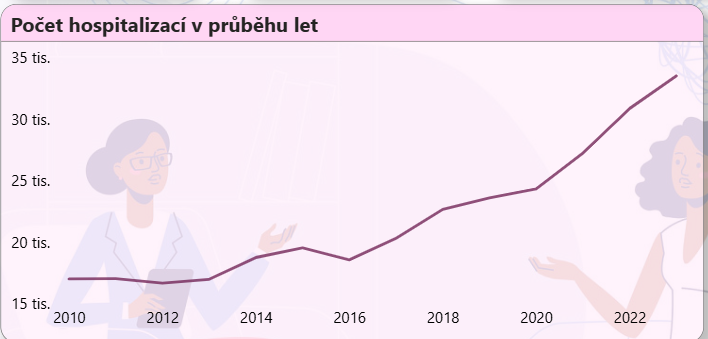
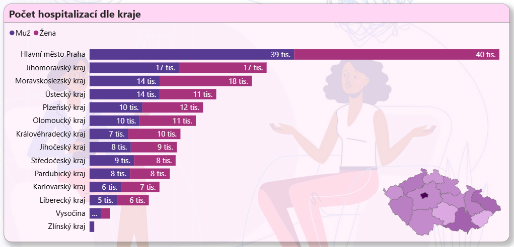
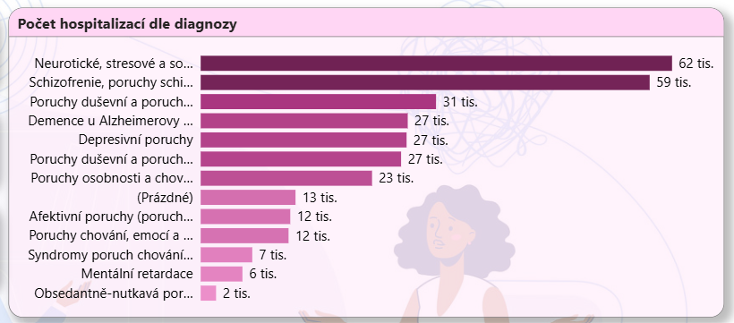

# Analýza akutní psychiatrické péče v ČR (2010–2023)

## 📌 Popis projektu
Tento Power BI report poskytuje komplexní přehled o akutní psychiatrické péči v České republice v letech 2010–2023.  
Cílem je vizualizovat a analyzovat:
- vývoj počtu hospitalizací v čase,
- rozdíly mezi pohlavími,
- regionální rozdíly mezi jednotlivými kraji,
- nejčastější diagnózy dle MKN-10 a jejich rozložení podle věkových skupin.

Projekt je určen pro studenty, výzkumníky i odbornou veřejnost, kteří se zajímají o stav a trendy v oblasti psychiatrické péče.

---

## 📊 Obsah reportu
- **Vývoj v čase** – základní metriky (celkový počet hospitalizací, počet hospitalizovaných jedinců, průměrná délka hospitalizace) a jejich vývoj v čase.  
- **Regiony ČR** – počty hospitalizací dle jednotlivých krajů, mapová vizualizace.  
- **Diagnózy** – nejčastější diagnózy dle MKN-10, zobrazení podle věkových skupin a pohlaví.  

---

## 📂 Datové zdroje
- **Hlavní data o hospitalizacích:** [Akutní péče v psychiatrii (NZIP)](https://www.nzip.cz/data/2059-akutni-pece-psychiatrie-otevrena-data)  
- **Kódy diagnóz:** [Číselník diagnóz MKN-10 (ÚZIS)](https://www.uzis.cz/index.php?pg=registry-sber-dat--klasifikace--mezinarodni-klasifikace-nemoci-mkn-10#publikace)  
- **Kódy věkových skupin:** [Číselník věkových skupin (NZIP)](https://www.nzip.cz/data/2182-ciselnik-vekove-skupiny-otevrena-data)  
- **JSON soubor pro mapu krajů:** [GitHub – kraje.json](https://github.com/jlacko/powerbi-cesko/blob/main/kraje.json)  

---

## 📷 Ukázky dashboardu

```markdown
  
  
  
